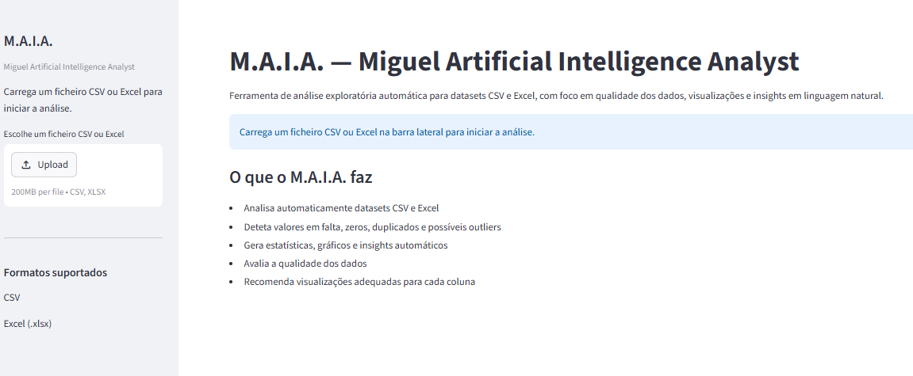
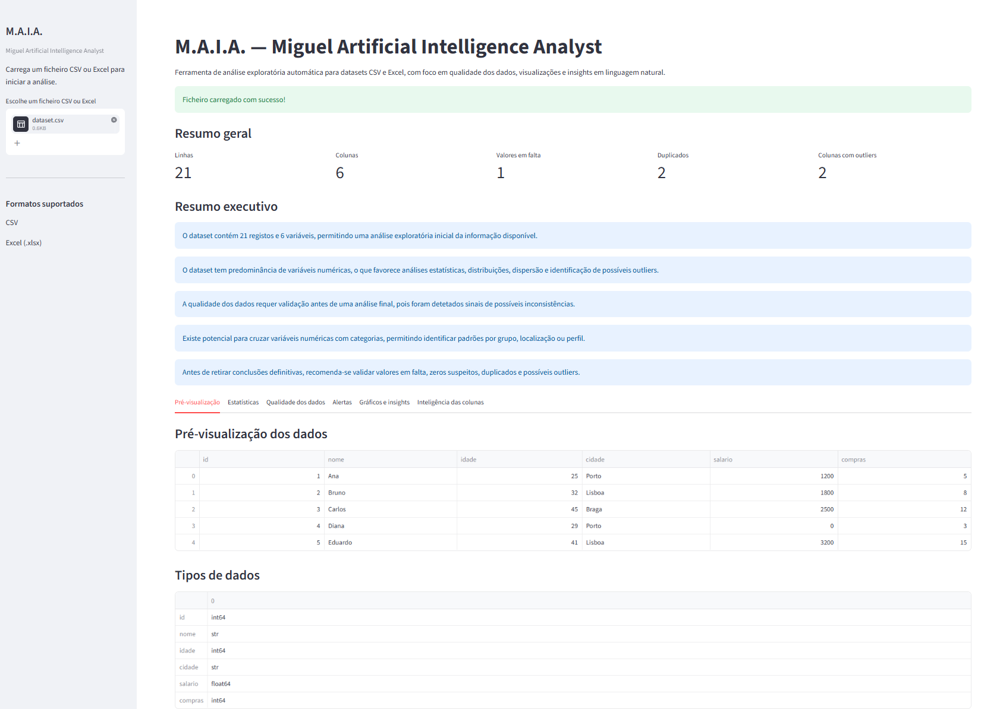
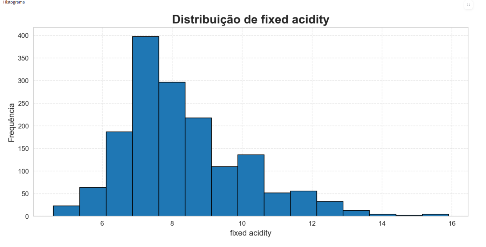

# M.A.I.A. — Miguel Artificial Intelligence Analyst

M.A.I.A. é uma aplicação de análise exploratória de dados desenvolvida em Python e Streamlit.  
O objetivo do projeto é permitir o carregamento de ficheiros CSV ou Excel e gerar automaticamente uma análise inicial do dataset, incluindo qualidade dos dados, estatísticas, visualizações e insights em linguagem natural.

## Objetivo do projeto

Este projeto foi desenvolvido como parte do meu percurso de transição para a área de Data Analysis, com foco em:

- análise exploratória de dados;
- qualidade dos dados;
- visualização de dados;
- interpretação automática de padrões;
- desenvolvimento de aplicações simples com Python.

## Funcionalidades principais

- Upload de ficheiros CSV e Excel
- Suporte a ficheiros Excel com múltiplas folhas
- Deteção automática de separadores em CSV
- Fallback de encoding para leitura de ficheiros
- Validação inicial do dataset
- Resumo executivo automático
- KPIs principais do dataset
- Estatísticas numéricas
- Deteção de valores em falta
- Deteção de valores zero
- Deteção de linhas duplicadas
- Alertas com níveis de gravidade
- Histogramas
- Boxplots
- Gráficos de barras
- Heatmap de correlação
- Insights automáticos por coluna
- Insights automáticos de correlação
- Análise inteligente das colunas
- Recomendação automática de visualizações

## Tecnologias utilizadas

- Python
- pandas
- Streamlit
- matplotlib
- seaborn
- openpyxl
 ## Screenshots

### Página inicial



### Resumo executivo



### Gráficos e insights

 (assets/grafico1.png) ((assets/grafico2.png)

## Estrutura do projeto

```text
M.A.I.A/
│
├── app.py
├── requirements.txt
├── README.md
├── .gitignore
│
├── modules/
│   ├── file_loader.py
│   ├── eda.py
│   ├── data_quality.py
│   ├── charts.py
│   ├── insights.py
│   └── column_intelligence.py
│
├── data/
├── assets/
└── reports/


