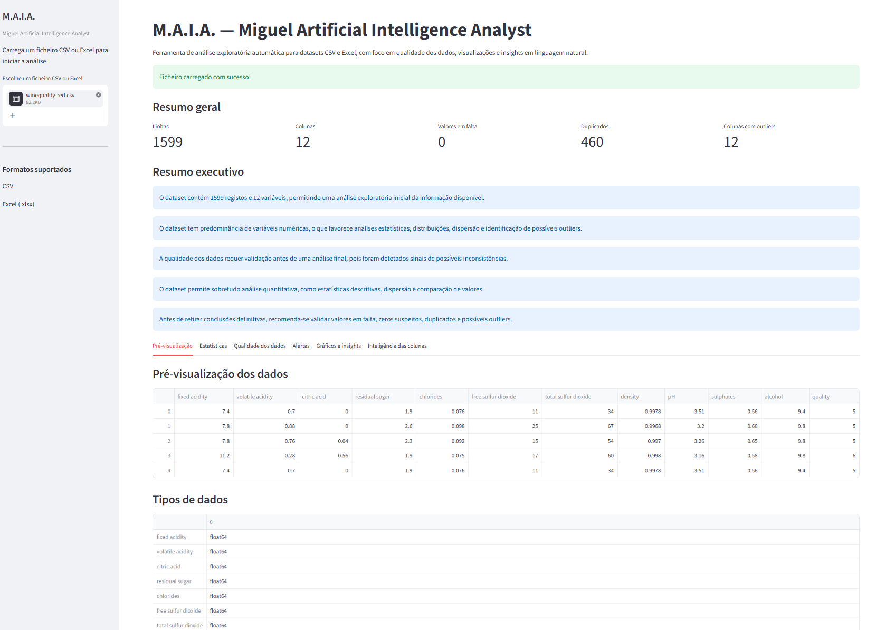
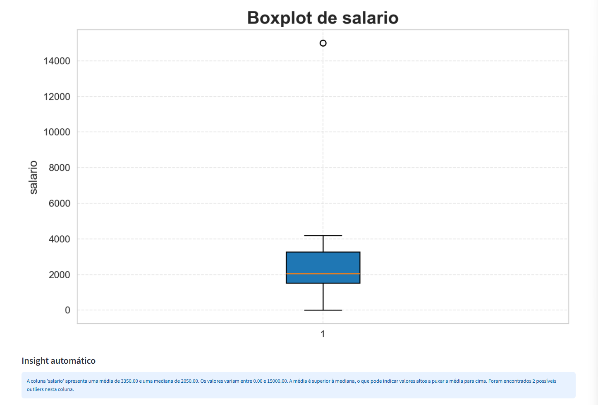
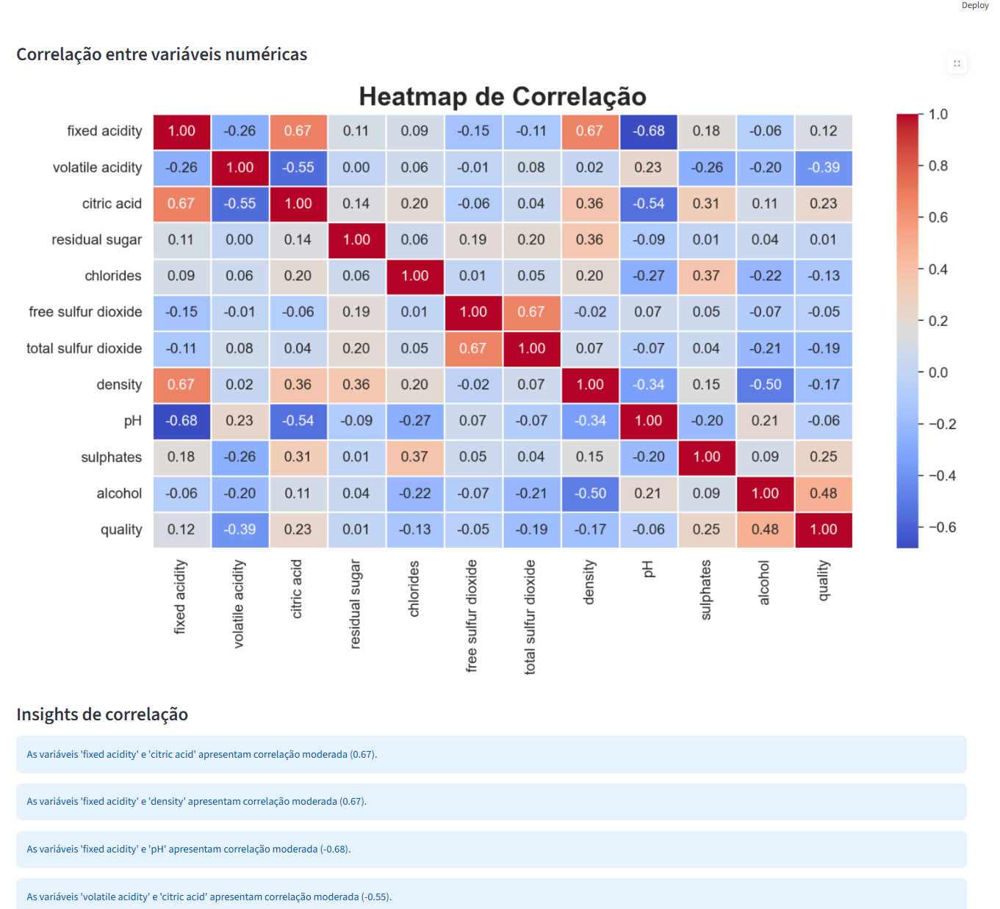

# M.A.I.A. — Miguel Artificial Intelligence Analyst

M.A.I.A. is an exploratory data analysis application built with Python and Streamlit.  
The goal of the project is to allow users to upload CSV or Excel files and automatically generate an initial analysis of the dataset, including data quality checks, statistics, visualizations and natural-language insights.

## Project Objective

This project was developed as part of my transition into the Data Analysis field, with a focus on:

- exploratory data analysis;
- data quality assessment;
- data visualization;
- automatic pattern interpretation;
- development of simple data applications with Python.

## Main Features

- CSV and Excel file upload
- Support for Excel files with multiple sheets
- Automatic CSV separator detection
- Encoding fallback for robust file reading
- Initial dataset validation
- Automatic executive summary
- Main dataset KPIs
- Numerical statistics
- Missing values detection
- Zero values detection
- Duplicate row detection
- Data quality alerts with severity levels
- Histograms
- Boxplots
- Bar charts
- Correlation heatmap
- Automatic insights by column
- Automatic correlation insights
- Smart column profiling
- Automatic visualization recommendations

## Technologies Used

- Python
- pandas
- Streamlit
- matplotlib
- seaborn
- openpyxl

## Screenshots

### Landing Page


### Executive Summary



### Charts and Insights






## Project Structure

```text
M.A.I.A/
│
├── app.py
├── requirements.txt
├── README.md
├── .gitignore
│
├── modules/
│   ├── file_loader.py
│   ├── eda.py
│   ├── data_quality.py
│   ├── charts.py
│   ├── insights.py
│   ├── column_intelligence.py
│   └── ui_components.py
│
├── data/
├── assets/
└── reports/
